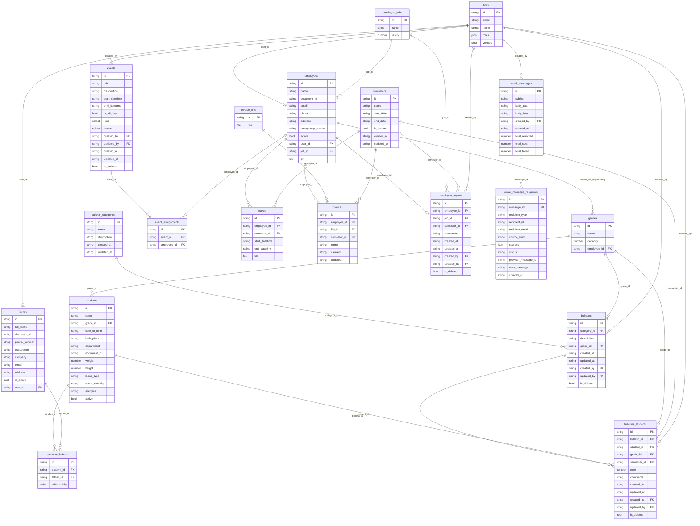

```mermaid
erDiagram
    users {
        string id PK
        string email
        string name
        json roles
        bool verified
    }

    students {
        string id PK
        string name
        string grade_id FK
        string date_of_birth
        string birth_place
        string department
        string document_id
        number weight
        number height
        string blood_type
        string social_security
        string allergies
        bool active
    }

    fathers {
        string id PK
        string full_name
        string document_id
        string phone_number
        string occupation
        string company
        string email
        string address
        bool is_active
        string user_id FK
    }

    employees {
        string id PK
        string name
        string document_id
        string email
        string phone
        string address
        string emergency_contact
        bool active
        string user_id FK
        string job_id FK
        file cv
    }

    grades {
        string id PK
        string name
        number capacity
        string employee_id FK
    }

    semesters {
        string id PK
        string name
        string start_date
        string end_date
        bool is_current
        string created_at
        string updated_at
    }

    employee_jobs {
        string id PK
        string name
        number salary
    }

    events {
        string id PK
        string title
        string description
        string start_datetime
        string end_datetime
        bool is_all_day
        select kind
        select status
        string created_by FK
        string updated_by FK
        string created_at
        string updated_at
        bool is_deleted
    }

    bulletin_categories {
        string id PK
        string name
        string description
        string created_at
        string updated_at
    }

    bulletins {
        string id PK
        string category_id FK
        string description
        string grade_id FK
        string created_at
        string updated_at
        string created_by FK
        string updated_by FK
        bool is_deleted
    }

    students_fathers {
        string id PK
        string student_id FK
        string father_id FK
        select relationship
    }

    event_assignments {
        string id PK
        string event_id FK
        string employee_id FK
    }

    bulletins_students {
        string id PK
        string bulletin_id FK
        string student_id FK
        string grade_id FK
        string semester_id FK
        number note
        string comments
        string created_at
        string updated_at
        string created_by FK
        string updated_by FK
        bool is_deleted
    }

    leaves {
        string id PK
        string employee_id FK
        string semester_id FK
        string start_datetime
        string end_datetime
        file file
    }

    invoices {
        string id PK
        string employee_id FK
        string file_id FK
        string semester_id FK
        string name
        string created
        string updated
    }

    invoice_files {
        string id PK
        file file
    }

    employee_reports {
        string id PK
        string employee_id FK
        string job_id FK
        string semester_id FK
        string comments
        string created_at
        string updated_at
        string created_by FK
        string updated_by FK
        bool is_deleted
    }

    email_messages {
        string id PK
        string subject
        string body_text
        string body_html
        string created_by FK
        string created_at
        number total_resolved
        number total_sent
        number total_failed
    }

    email_message_recipients {
        string id PK
        string message_id FK
        string recipient_type
        string recipient_id
        string recipient_email
        string source_kind
        json sources
        string status
        string provider_message_id
        string error_message
        string created_at
    }

    %% Relationships

    users ||--o| fathers : "user_id"
    users ||--o| employees : "user_id"

    employee_jobs ||--o{ employees : "job_id"
    employees ||--o{ grades : "employee_id (teacher)"

    grades ||--o{ students : "grade_id"

    students ||--o{ students_fathers : "student_id"
    fathers ||--o{ students_fathers : "father_id"

    events ||--o{ event_assignments : "event_id"
    employees ||--o{ event_assignments : "employee_id"

    bulletin_categories ||--o{ bulletins : "category_id"
    grades ||--o{ bulletins : "grade_id"
    users ||--o{ bulletins : "created_by"

    bulletins ||--o{ bulletins_students : "bulletin_id"
    students ||--o{ bulletins_students : "student_id"
    grades ||--o{ bulletins_students : "grade_id"
    semesters ||--o{ bulletins_students : "semester_id"
    users ||--o{ bulletins_students : "created_by"

    employees ||--o{ leaves : "employee_id"
    semesters ||--o{ leaves : "semester_id"

    employees ||--o{ invoices : "employee_id"
    invoice_files ||--o{ invoices : "file_id"
    semesters ||--o{ invoices : "semester_id"

    employees ||--o{ employee_reports : "employee_id"
    employee_jobs ||--o{ employee_reports : "job_id"
    semesters ||--o{ employee_reports : "semester_id"
    users ||--o{ employee_reports : "created_by"

    users ||--o{ email_messages : "created_by"
    email_messages ||--o{ email_message_recipients : "message_id"

    users ||--o{ events : "created_by"
```
